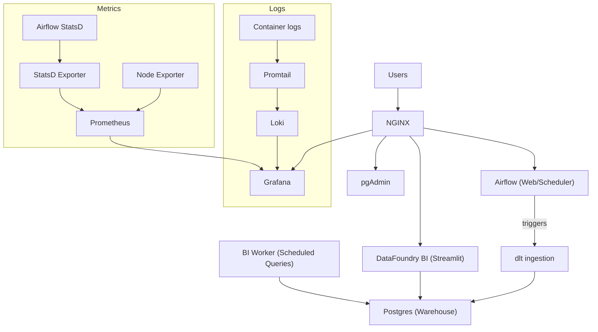

# DataFoundry

DataFoundry is a local‑first, fully open‑source analytics platform that installs a complete data + BI stack on a single machine with one command. It is designed to be self‑hosted, cloud‑independent, and repeatable.

## Core Principles
- Local‑only, no cloud assumptions
- Fully open source
- Infrastructure as code
- Opinionated defaults
- Minimal configuration surface
- One‑command install
- Idempotent and repeatable
- Designed for 100–1000+ business users on a single node

## Architecture (Mermaid)


## Components
- **NGINX**: single entrypoint + reverse proxy
- **Postgres**: analytics warehouse and metadata
- **DataFoundry BI (Streamlit)**: BI UI and charts
- **BI Worker**: scheduled query runner and cache warmer
- **Airflow**: orchestration (webserver, scheduler)
- **dlt**: ingestion pipelines
- **Grafana**: logs + metrics UI
- **Prometheus**: metrics storage
- **Loki**: logs storage
- **Promtail**: log shipping
- **pgAdmin**: Postgres UI
- **Node Exporter / StatsD Exporter / Alertmanager**: system metrics and alerts

## Single URL Access
All UIs are routed through NGINX:
- BI: `http://<host>:8080/bi/`
- Airflow: `http://<host>:8080/airflow/`
- Grafana: `http://<host>:8080/grafana/`
- pgAdmin: `http://<host>:8080/pgadmin/`

## Quickstart
1. Ensure Docker is running.
2. Run the bootstrap.
3. Open BI, Airflow, Grafana, and pgAdmin via NGINX.

```bash
./bootstrap.sh
```

On Windows:
```powershell
.\bootstrap.ps1
```

## Prerequisites
- Linux, macOS, or Windows
- Docker and Docker Compose
- 4 vCPU / 16 GB RAM minimum (8 vCPU / 32 GB recommended)

## What Bootstrap Does
The `bootstrap.sh` script:
- Generates `.env` if missing (writes credentials to `data/credentials.txt`)
- Creates persistent volumes under `./data`
- Applies safe permissions for all services
- Starts the full Docker Compose stack
- Leaves the stack running behind NGINX

## Configuration
All user configuration is provided via `.env`. Defaults are opinionated and safe to run locally.

Key variables:
- `DF_HOSTNAME`
- `POSTGRES_DB`, `POSTGRES_USER`, `POSTGRES_PASSWORD`
- `AIRFLOW_DB`
- `BI_ADMIN_USERNAME`, `BI_ADMIN_PASSWORD`, `BI_BASE_URL`
- `BI_SCHEDULER_POLL_SECONDS`, `BI_DASHBOARD_CACHE_TTL_SECONDS`
- `AIRFLOW_ADMIN_USERNAME`, `AIRFLOW_ADMIN_PASSWORD`, `AIRFLOW_ADMIN_EMAIL`
- `AIRFLOW__CORE__FERNET_KEY`, `AIRFLOW__WEBSERVER__BASE_URL`, `AIRFLOW__WEBSERVER__WEB_SERVER_URL_PREFIX`
- `AIRFLOW_UID`
- `GRAFANA_ADMIN_USER`, `GRAFANA_ADMIN_PASSWORD`
- `NYC_TAXI_URL`

## Credentials
On first run, credentials are written to:
- `data/credentials.txt`

## Data Ingestion (NYC Taxi)
On first boot, Airflow triggers a full refresh ingestion of NYC Taxi data via dlt.
- DAG: `airflow/dags/nyc_taxi_full_refresh.py`
- dlt script: `airflow/dags/nyc_taxi_dlt.py`

## Adding New Data Sources
Use Airflow to define new ingestion DAGs or extend the dlt scripts.
- Add a new DAG under `airflow/dags/`
- Use `dlt` to load data into Postgres schemas
- Refresh BI queries and charts afterward

## DataFoundry BI Features
The BI app provides:
- SQL Lab with ad‑hoc queries
- Saved queries
- Charts library (table, line, bar, area, scatter, pie, metric)
- Dashboards with layout controls and filters
- Drag‑and‑drop dashboard ordering
- Scheduled refreshes via BI Worker
- Query result caching with TTL
- RBAC (Admin / Analyst / Viewer)
- Multi‑tenant workspaces
- Multi‑datasource metadata layer
- Audit logs

## How BI Connects to Postgres
The BI service is already wired to the internal Postgres:
- Datasource name: **Warehouse**
- Connection: `postgresql+psycopg2://<user>:<pass>@postgres:5432/<db>`

You can add more datasources in the BI app (Admin → Datasources).

## Logging and Metrics
- Application logs flow to Loki via Promtail
- Metrics are scraped by Prometheus and visualized in Grafana
- Airflow emits StatsD metrics to Prometheus

## Alerting
Alertmanager is included and pre‑wired.
- Configure Slack routing by editing `scripts/metrics/alertmanager.yml`

## Common Commands
Start:
```bash
docker compose up -d --build
```

Stop:
```bash
docker compose down
```

Reset data:
```bash
./reset.sh
```

## Troubleshooting
- Check container status: `docker compose ps`
- Check logs: `docker compose logs --tail=200 <service>`
- Rebuild a service: `docker compose up -d --build <service>`

Common issues:
- Port conflicts: change NGINX port mapping in `docker-compose.yml`
- Permissions: rerun `./bootstrap.sh` (it fixes ownership and modes)

## Production Notes
This is a single‑node architecture. For production‑grade deployments:
- Use fast disks for Postgres and Loki volumes
- Add backups for `./data/postgres` and `./data/logging`
- Consider SSL termination at NGINX or a reverse proxy upstream
- Set strong passwords in `.env`

## Supported Platforms
- Linux: native Docker
- macOS: Docker Desktop
- Windows: Docker Desktop + `bootstrap.ps1`

## File Structure
- `docker-compose.yml` runtime services
- `bootstrap.sh` one‑command installer
- `docker/` images and Dockerfiles
- `scripts/` init, bootstrap, and provisioning
- `airflow/dags/` ingestion workflows
- `bi/` DataFoundry BI app

## License
Open source, local‑first, self‑hosted analytics.
