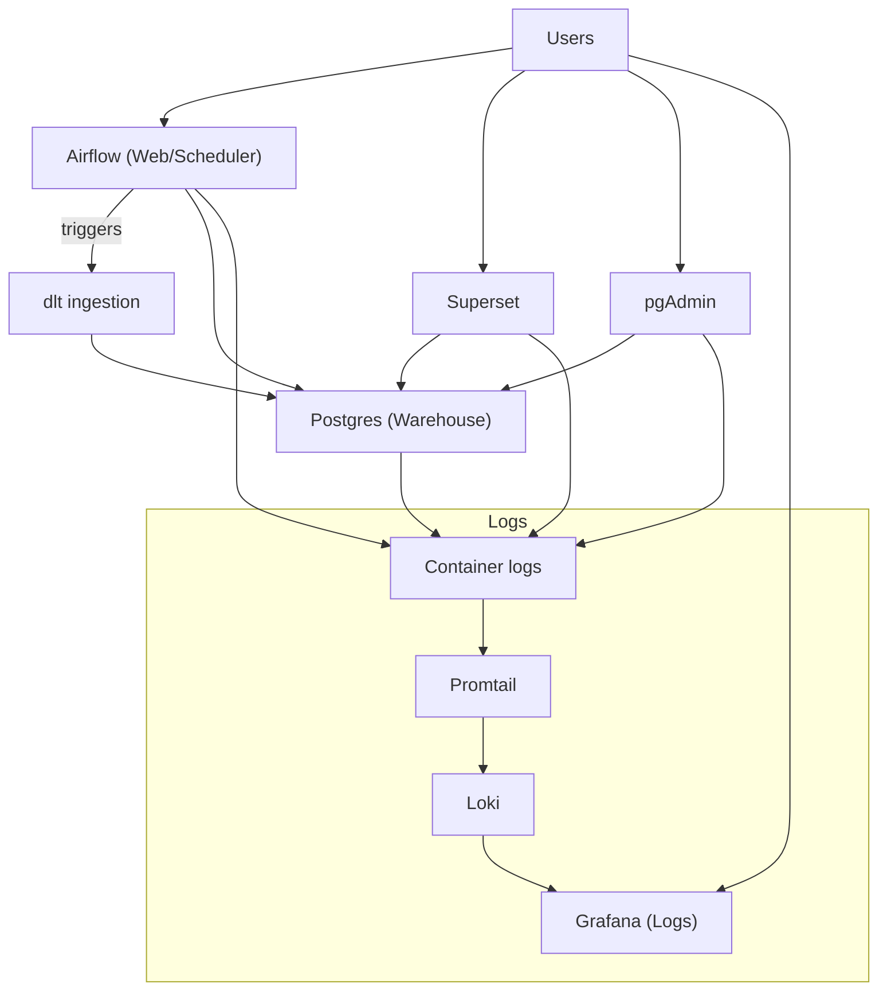

# DataFoundry

DataFoundry is a local‑first, fully open‑source analytics platform that installs a complete data + orchestration stack on a single machine with one command. It is designed to be self‑hosted, cloud‑independent, and repeatable for small teams.

## Core Principles
- Local‑only, no cloud assumptions
- Fully open source
- Infrastructure as code
- Opinionated defaults
- Minimal configuration surface
- One‑command install
- Idempotent and repeatable
- Designed for small teams running on a single node

## Architecture (Mermaid)


## Components
- **Postgres**: analytics warehouse and metadata
- **Airflow**: orchestration (webserver, scheduler)
- **dlt**: ingestion pipelines
- **Superset**: BI and dashboarding
- **Grafana + Loki + Promtail**: log capture and dashboard
- **pgAdmin**: Postgres UI

## Endpoints
- Airflow: `http://<host>:8080/`
- Superset: `http://<host>:8088/`
- Logs (Grafana): `http://<host>:3001/`
- pgAdmin: `http://<host>:5050/`
- Postgres: `localhost:5432`

## Quickstart
1. Ensure Docker is running.
2. Start the stack.
3. Open Airflow, Superset, and pgAdmin (and Grafana for logs).

```bash
docker compose up -d
```

## Prerequisites
- Linux, macOS, or Windows
- Docker and Docker Compose
- 4 vCPU / 16 GB RAM minimum

## First-Run Setup
The Compose stack includes an internal `setup` service that:
- Creates persistent folders under `./data`
- Prepares pgAdmin auto‑registration files
- Applies safe permissions

## Configuration
All user configuration is provided via `.env`. Defaults are opinionated and safe to run locally.

Key variables:
- `DF_HOSTNAME`
- `POSTGRES_DB`, `POSTGRES_USER`, `POSTGRES_PASSWORD`
- `AIRFLOW_DB`
- `SUPERSET_DB`
- `AIRFLOW_ADMIN_USERNAME`, `AIRFLOW_ADMIN_PASSWORD`, `AIRFLOW_ADMIN_EMAIL`
- `AIRFLOW__CORE__FERNET_KEY`, `AIRFLOW__WEBSERVER__BASE_URL`
- `AIRFLOW__WEBSERVER__WEB_SERVER_HOST`, `AIRFLOW__WEBSERVER__WEB_SERVER_PORT`
- `AIRFLOW_UID`
- `SUPERSET_ADMIN_USERNAME`, `SUPERSET_ADMIN_PASSWORD`, `SUPERSET_ADMIN_EMAIL`, `SUPERSET_SECRET_KEY`
- `GRAFANA_ADMIN_USER`, `GRAFANA_ADMIN_PASSWORD`
- `PGADMIN_EMAIL`, `PGADMIN_PASSWORD`
- `NYC_TAXI_URL`

## Credentials
Credentials are written to:
- `data/credentials.txt`

Generate/refresh credentials:
```bash
make creds
```

## Data Ingestion (NYC Taxi)
On first boot, Airflow triggers a full refresh ingestion of NYC Taxi data via dlt.
- DAG: `airflow/dags/nyc_taxi_full_refresh.py`
- dlt script: `airflow/dags/nyc_taxi_dlt.py`

## Adding New Data Sources
Use Airflow to define new ingestion DAGs or extend the dlt scripts.
- Add a new DAG under `airflow/dags/`
- Use `dlt` to load data into Postgres schemas

## Superset Database Connection
Superset uses its own metadata DB automatically. To query your warehouse, add a Database connection in Superset:

Connection string:
```
postgresql+psycopg2://datafoundry:<POSTGRES_PASSWORD>@postgres:5432/datafoundry
```

Notes:
- Replace `<POSTGRES_PASSWORD>` with the value in `data/credentials.txt`
- Database name is `datafoundry` by default (or `POSTGRES_DB` if you changed it)
- Host must be `postgres` (the Docker service name), not `localhost`

## Common Commands
Start:
```bash
docker compose up -d --build
```

Stop:
```bash
docker compose down
```

Reset data:
```bash
./reset.sh
```

## Troubleshooting
- Check container status: `docker compose ps`
- Check logs: `docker compose logs --tail=200 <service>`
- Rebuild a service: `docker compose up -d --build <service>`

Common issues:
- Port conflicts: change port mapping in `docker-compose.yml`
- Permissions: rerun `docker compose up -d` (setup service fixes ownership and modes)

## Local Dev (LSP / Editor Setup)
This repo is containerized, so your editor needs a local Python environment for LSP/type hints.

One‑time setup:
```bash
./scripts/dev/setup_venv.sh
```

This creates `.venv/` and installs a lean dev dependency set from:
- `/Users/jordangoodman/Documents/DataFoundry/requirements-dev.txt`

For VS Code, a workspace config is included:
- `/Users/jordangoodman/Documents/DataFoundry/.vscode/settings.json`

If you use another editor, point it at:
- `/Users/jordangoodman/Documents/DataFoundry/.venv/bin/python`

## Production Notes
This is a single‑node architecture. For production‑grade deployments:
- Use fast disks for `./data/postgres`
- Add backups for `./data/postgres`
- Set strong passwords in `.env`

## Supported Platforms
- Linux: native Docker
- macOS: Docker Desktop
- Windows: Docker Desktop

## File Structure
- `docker-compose.yml` runtime services
- `docker/` images and Dockerfiles
- `scripts/` init and provisioning
- `airflow/dags/` ingestion workflows

## License
Open source, local‑first, self‑hosted analytics.
