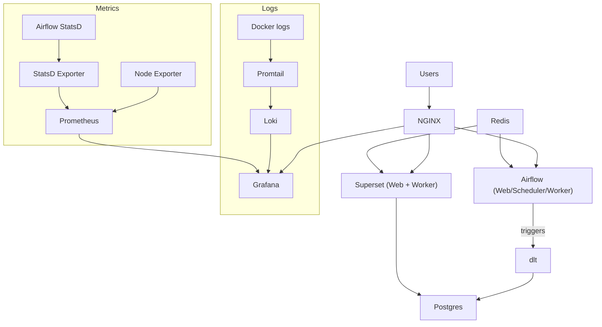

# Architecture

## Components (Concise)
- **NGINX**: Single entrypoint and reverse proxy. Routes `/superset/`, `/airflow/`, `/grafana/`.
- **PostgreSQL**: Primary analytics warehouse and metadata store.
- **Redis**: Cache and async coordination (Superset caching, Airflow Celery broker).
- **Superset Web**: BI UI and API.
- **Superset Worker**: Background queries and async tasks.
- **Airflow Webserver**: Orchestration UI and API.
- **Airflow Scheduler**: Schedules DAGs and task instances.
- **Airflow Worker**: Executes tasks with Celery.
- **dlt**: Ingestion pipelines that load data into Postgres.
- **Promtail**: Docker log shipper that tails container logs.
- **Loki**: Log storage backend.
- **Grafana**: Logs + metrics dashboards.
- **Prometheus**: Metrics scraper and time‑series store.
- **Node Exporter**: Host metrics (CPU, memory, disk, network).
- **StatsD Exporter**: Bridges Airflow StatsD metrics into Prometheus.

## Data + Control Flow
- Users access **NGINX** which routes to Superset, Airflow, and Grafana.
- **Airflow** schedules ingestion using **dlt**, loading data into **Postgres**.
- **Superset** queries **Postgres** for dashboards and charts.
- **Redis** backs Superset caching and Airflow Celery execution.
- **Promtail** ships container logs into **Loki**.
- **Grafana** reads logs from Loki and metrics from **Prometheus**.
- **Prometheus** scrapes **Node Exporter** and **StatsD Exporter**.

## ASCII Diagram
```
                         +----------------------+
                         |       Users          |
                         +----------+-----------+
                                    |
                                    v
                             +------+------+
                             |    NGINX    |
                             +---+---+-----+
                                 |   |
          +----------------------+   +----------------------+
          |                                              |
          v                                              v
+---------------------+                        +---------------------+
|     Superset        |                        |      Airflow        |
|  Web + Worker       |                        | Web/Scheduler/Worker|
+----------+----------+                        +----------+----------+
           |                                              |
           |                                              | triggers
           v                                              v
     +-----+-----+                               +--------+--------+
     | Postgres  |<--------- dlt loads ----------|      dlt         |
     +-----+-----+                               +-----------------+
           ^
           |
      +----+----+
      | Redis   |
      +----+----+
           |
           | Celery + cache
           v
+---------------------+
|  Superset/Airflow   |
|    async tasks      |
+---------------------+

  Logs + Metrics:

  Docker logs -> Promtail -> Loki -> Grafana
  Node Exporter -> Prometheus -> Grafana
  Airflow StatsD -> StatsD Exporter -> Prometheus -> Grafana
```

## Mermaid Diagram

